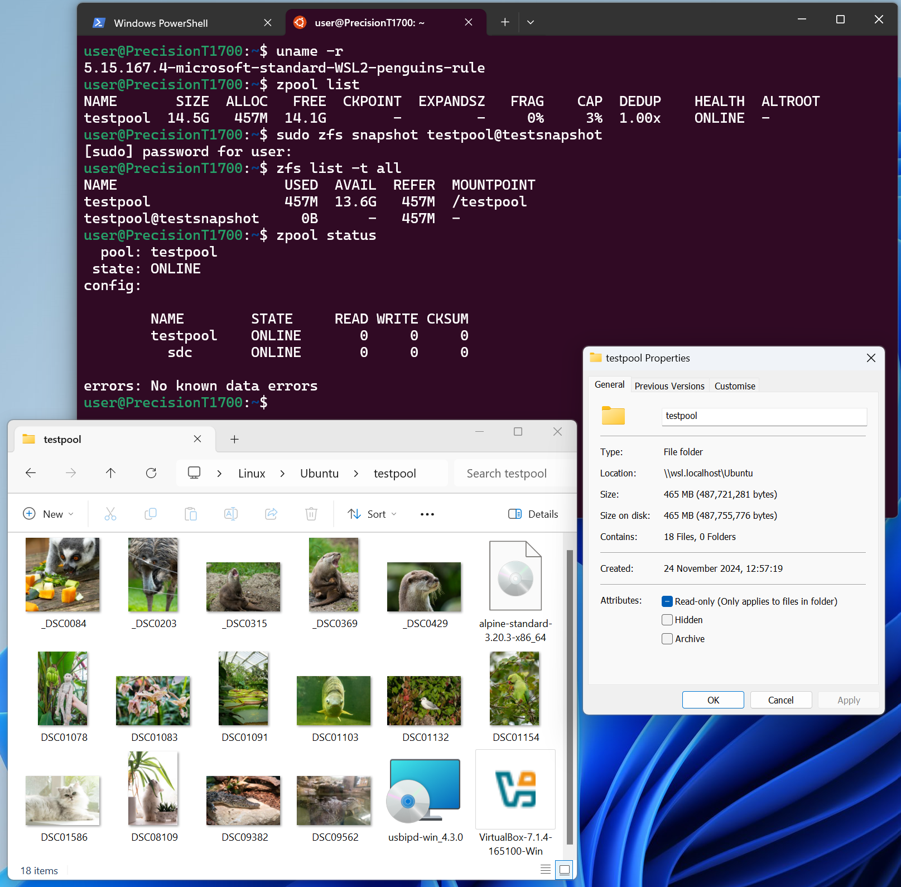

# ZFS-on-WSL 🐧🪟

**Note:** _There is a slightly more detailed version of this README available [as a blog post on my site now](https://blog.infected.systems/posts/2024-11-24-zfs-on-wsl/)_.

ZFS? In my WSL? ... It's more likely than you think.

This is a set of scripts and methods intended to allow the use of ZFS on WSL2 by building a custom kernel along with the relevant userspace utilities.

With the custom kernel built with this script, we can use a ZFS pool mounted inside WSL transparently from Windows as if it was part of the native filesystem:


<span style='color: red;'>**Disclaimer:** _This does work, but is intended mostly for fun and learning. Please don't use this for any data you actually care about!_</span>

### Why do we need this?
By default, Ubuntu (the flagship WSL distro) ships the ZFS utilities inside the `zfsutils-linux` package. We can install this package inside WSL2 Ubuntu, but unfortunately it doesn't work. This is because although the package contains the _userspace_ ZFS utilities, it expects the kernel we're running to contain the OpenZFS kernel modules that provide the ZFS filesystem.

On most distributions, this is solved by building the ZFS code as a loadable kernel module which can be inserted into the kernel at runtime. Some distributions automate this with DKMS and some - like Ubuntu or Alpine - build the ZFS modules themselves to be installed and loaded by a package.

Unfortunately, WSL defaults to using a monolithic kernel built by Microsoft without loadable modules from what I can tell. So our best option is to build our own kernel, with the ZFS modules statically compiled in.

This repo is a quick and nasty script that automates:
* Pulling Microsoft's latest WSL2 kernel code from their upstream
* Pulling the latest OpenZFS code
* Building the OpenZFS userspace utilities against our kernel
* Installing the OpenZFS userspace utilities
* Building the kernel, with ZFS as a statically built module, and support for USB Mass Storage Devices
* Putting the kernel somewhere sensible on disk, for us to add it to our `.wslconfig`

### Build instructions
Download this script into an Ubuntu instance running on WSL 2:
```sh
wget https://github.com/alexhaydock/zfs-on-wsl/raw/refs/heads/main/zfs-on-wsl.sh
```

Now execute the script (without `sudo` privileges):
```sh
./zfs-on-wsl.sh
```

### Note for users on lower-memory (<16 GB) systems
If you are running on a system with under 16GB RAM, Windows may not allocate enough RAM to the WSL2 VM to complete a kernel build.

You can find out how much RAM your WSL2 environment has by running the following command inside a WSL2 terminal:
```sh
free -mh
```

To resolve this, you can add a line to the `.wslconfig` file in your home directory to give the build environment more RAM:
```ini
[wsl2]
memory=6GB
```

### Kernel installation instructions
By default, the script in this repo will write our new kernel to `C:\ZFSonWSL\bzImage-new`.

We need to move it to `C:\ZFSonWSL\bzImage` and then make the changes below.

Stop the WSL2 VM if it is currently running:
```bat
wsl --shutdown
```

Edit the `.wslconfig` file in your home directory to point to the downloaded kernel:
```ini
[wsl2]
kernel=C:\\ZFSonWSL\\bzImage
localhostForwarding=true
swap=0
```

Start up WSL again by opening a new WSL session and check that our custom kernel is being used:
```
$ uname -a
Linux PrecisionT1700 5.15.167.4-microsoft-standard-WSL2-penguins-rule #4 SMP Sat Nov 23 19:15:47 GMT 2024 x86_64 x86_64 x86_64 GNU/Linux
```

### Passing through drives (native)
At this point, you probably want to pass through some drives to make a pool with using `zpool create`. For **non-USB** storage devices, you can achieve this as below.

List your drives:
```powershell
GET-CimInstance -query "SELECT * from Win32_DiskDrive"
```

Pick the drive you want, and mount it into the WSL2 VM:
```powershell
wsl --mount --bare \\.\PHYSICALDRIVE1
```

### Passing through drives (USB Mass Storage)
If you want to use USB drives instead, you will get an error if you try to use the above method. Instead, you need to use `usbipd` to make this work.

Install `usbipd-win` as per [Microsoft's guide here](https://learn.microsoft.com/en-us/windows/wsl/connect-usb):
```powershell
winget install --interactive --exact dorssel.usbipd-win
```

List your USB devices:
```powershell
usbipd list
```

Bind the device you want to use with `usbipd`, based on the bus ID shown in the list:
```powershell
usbipd bind --busid 7-2
```

Attach the bound device to the WSL2 VM:
```
usbipd attach --wsl --busid 7-2
```

### Interacting with mounted drives
Using the methods above, you can interact with mounted drives as you would any block device on a standard Linux system. Try `lsblk` to inspect mounted drives to make sure they're working as expected.

### Using ZFS
Once you've got drives passed through as block devices, all the regular ZFS commands you're used to will work.

Try creating a pool with:
```sh
sudo zpool create poolname /path/to/passed/through/disk
```

And then:
```sh
zpool status
```

or maybe:
```sh
zfs list
```

### Known issues
* For some reason, I can't build a ZFS pool out of sparse files. This is covered in [issue #1 in this repo](https://github.com/alexhaydock/zfs-on-wsl/issues/1). I'm not sure why this doesn't work. If you're looking to simply test whether ZFS is working after running this script, I recommend finding a USB drive you don't care much about and using the USB Mass Storage method above to do some testing.
